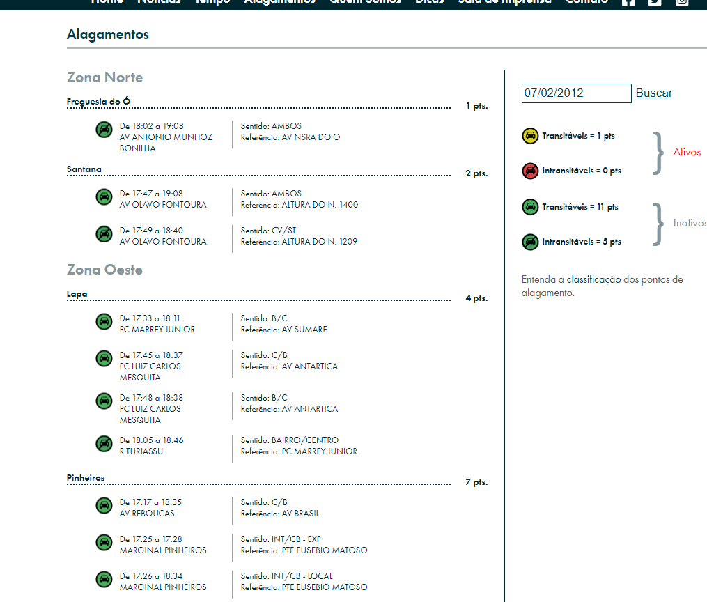
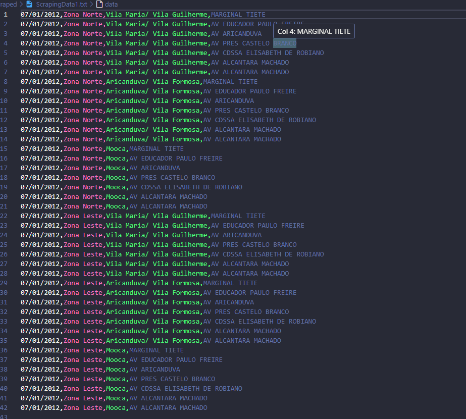

# Scraping de Alagamentos em São Paulo

### Este projeto utiliza a biblioteca JSoup para realizar scraping de dados sobre alagamentos em São Paulo a partir do site da CGESP (Centro de Gerenciamento de Emergências Climáticas) e transforma esses dados em um arquivo CSV.

 O usuario digita uma data inicial e quantos meses anteriores deseja pesquisar. Entao o programa faz o scrapping de dados de cada mes e o persiste em um arquivo para cada mes.

